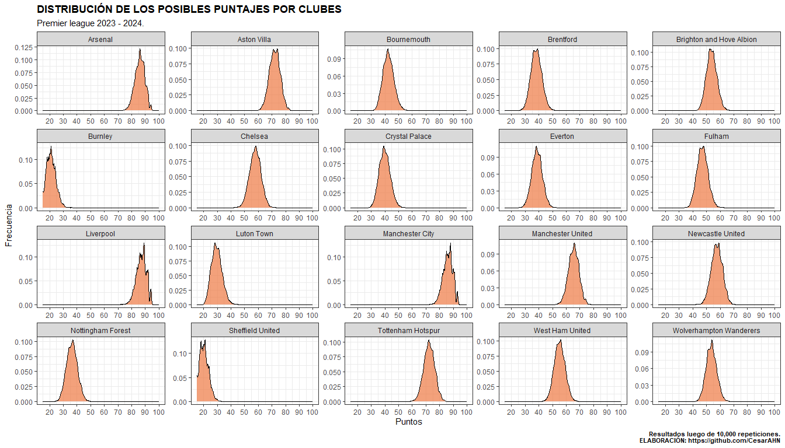
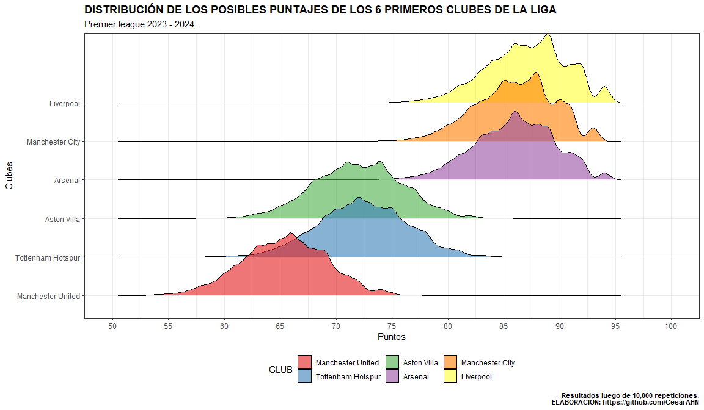
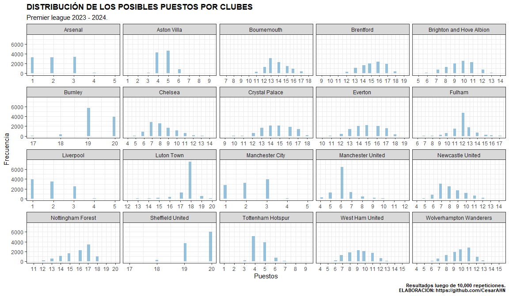

# PRONÓSTICOS DE LA PREMIER LEAGUE 2023 - 2024.

# BIENVENIDOS!!!

Se crea este repertorio para poder determinar las probabilidades de
ganar la premier, clasificar a champions league y descensos, para de
cada uno de los clubes de la premier league. Para tal fin, primero se
crea una función que permita calcular los resultados posibles de los
partidos (goles a favor, goles en contra, diferencia de goles, puntos y
puesto), desde la fecha actual 2024-03-13.

A cada club se le asigna un score de local y de visita, de manera
objetiva, por el momento el número está determinado por mi. Pero en
futuras actualizaciones se puede implementar un modelo que realice esta
asignación de puntajes en función a varios criterios, como el resultado
en los últimos 5 partidos, el número de lesionados, el número de goles
concedidos, entre otros. Este score, va de 0 a 1, mientras el score sea
más alto se entiende que el club tiene más probabilidades de ganar.

La función que simula los partidos toma como insumo estos scores,
posterior a ello se realiza un proceso montecarlo con el cual se evalúa
la función 10,000 veces (puede fijar el número de repeticiones que
desee). Con lo cual se obtiene 10,000 resultados posibles por cada
partido.

Al final se calcula las probabilidades en función a los resultados
posibles.

USted encuentra todo el código en este repositorio, el archivo se llama
**sc_premier_league.R**. El código está automatizado para que cada vez
que termine una fecha usted pueda correr el código y obtener las
probabilidades actualizadas. Así que si desea puede correrlo pasando la
fecha 29 o la fecha 37, sin ningún problema.

Asimismo, las imagenes que verán a continuación solo se irán
actualizando cada vez que actualice el repertorio.

La primera versión del repositorio se publicó el 13 de Marzo del 2024,
luego de la culminación de la fecha 28 del torneo.

## Tabla de posiciones.

Se obtendrá la tabla de posiciones dese la web de **Skysports**,
actualizado a la fecha 2024-03-13. Para extraer estos datos desde la web
se usa el método de web scraping.

``` r
tab_pos %>% as_tibble() %>% gt() %>%
  gt_theme_espn() %>% tab_header(title = "TABLA DE POSICIONES PREMIER LEAGUE",
                                 subtitle = paste0("Actualizado al ", Sys.Date()))
```

<p align="center">


</p>

## El calendario de partidos pendientes.

También se usa como fuente la web **Skysports**.

``` r
#-------------
# Calendario.
#-------------
pw<-read_html("https://www.skysports.com/premier-league-fixtures")

fechas<-pw %>% html_elements("span.swap-text__target") %>% html_text2()

fechas<-fechas[-1]
fechas[fechas!=""]->fechas

tab_calendario<-data.frame(LOCAL=fechas[seq(1,length(fechas),by=2)],
                           VISITANTE=fechas[seq(2,length(fechas),by=2)])

# Temporal. 
# falta el partido del Chelsea vs el Tottenham
if (tab_calendario %>% filter(LOCAL=="Chelsea" & VISITANTE=="Tottenham Hotspur") %>% nrow()==0){
  tab_calendario %>% bind_rows(data.frame(LOCAL="Chelsea",VISITANTE="Tottenham Hotspur"))->tab_calendario
}
```

La web de **Skysports** no considera el partido pospuesto entre el
Chelsea vs el Tottenham. Por lo cuál se agrega al calendario. Como se
podrá dar cuenta no debería de preocuparse por este detalle ya que la
agregación de este compromiso viene condicionado a la actualización de
la web. Es así que cuando la web agregue ese partido no será necesario
agregarlo.

## Desempeño de los clubes.

Todos los clubes no tienen el mismo desempeño, por lo cual se crea un
tipo de índice de desempeño en donde se consideran 2 características: el
puntaje de desempeño como visitante, el puntaje de desempeño como local.
Estas características reciben puntajes desde 0 hasta 1, en donde 0
significa que el club tiene un desempeño paupérrimo, mientras que 1
significa que su desempeño es sobresaliente.

Los dos puntajes son arbitrarios ya que el desempeño de partidos pasados
no es indicador del desempeño futuro de un club, por más objetivo que se
piense que es. Por lo cual, solo se podría indicar que tan buenos son de
visita (primera característica), o que tan buenos son de locales
(segunda característica)

En ese sentido los puntajes lo he asignado en función a mis
conocimientos deportivos. Usted puede asignar otros puntajes y obtendrá
resultados distintos, pero es importante no perder la objetividad.

A continuación muestro el puntaje para cada una de los clubes y sus
respectivos scores de visita y local.

como se mencionó, previamente, los scores pueden ser determinados, a
través, de un modelo que considere variables observables. Pero eso lo
abordaremos en la siguiente actualización del repertorio.

``` r
pp %>% as_tibble() %>% gt() %>%
  gt_theme_espn() %>% 
  tab_header(title = "ÍNDICE DE DESEMPEÑO DE LOCAL Y VISITANTE PARA CADA UNO DE LOS CLUBES", subtitle = "Puntajes según juicios de expertos") %>% 
  tab_source_note("ELABORACIÓN: https://github.com/CesarAHN")
```

<p align="center">

</p>

## Función que simule el resultado de los partidos.

Se crea la función que determinará el resultado de cada partidos. Esta
función considera dos argumentos: la tabla de posiciones consolidada
hasta la fecha y el desempeño de las selecciones.

La función es la siguiente:

``` r
simulador_partidos<-function(tab_pos,pp,tab_calendario){

  resultados<-data.frame()
  for (i in 1:nrow(tab_calendario)) {
    d<-(1-(pp[pp$CLUB==tab_calendario[i,1],2]-pp[pp$CLUB==tab_calendario[i,2],3])) %>% pull()
    if(d<1){
      a1<-rbind(data.frame(CLUB=tab_calendario[i,1], GF_=sample(0:4,1, prob = c(1*d/10,2*d/10,3*d/10,4*d/10,(1-d)))),
                data.frame(CLUB=tab_calendario[i,2], GF_=sample(0:4,1, prob = c((1-d),5*d/14,4*d/14,3*d/14,2*d/14)))) 
    } else {
      d<-(1-(pp[pp$CLUB==tab_calendario[i,2],2]-pp[pp$CLUB==tab_calendario[i,1],3])) %>% pull()
      a1<-rbind(data.frame(CLUB=tab_calendario[i,2], GF_=sample(0:4,1, prob = c(1*d/10,2*d/10,3*d/10,4*d/10,(1-d)))),
                data.frame(CLUB=tab_calendario[i,1], GF_=sample(0:4,1, prob = c((1-d),5*d/14,4*d/14,3*d/14,2*d/14)))) 
    }
    a1$GC_<-rev(a1$GF_)
    a1$PTS_<-ifelse(a1$GF_>a1$GC_,3,
                    ifelse(a1$GF_==a1$GC_,1,0))
    a1$G_<-ifelse(a1$PTS_==3,1,0)
    a1$P_<-rev(a1$G_)
    a1$E_<-ifelse(a1$PTS_==1,1,0) 
    resultados<-rbind(resultados,a1)
  }
  resultados %>% group_by(CLUB) %>% mutate(n=1) %>% summarise_all(~sum(.))->resultados
  
  tab_pos_final<-left_join(tab_pos,resultados, by="CLUB")

  tab_pos_final<-tab_pos_final %>% mutate(J=J+n, G=G+G_, E=E+E_, P=P+P_, GF=GF+GF_, GC=GC+GC_,
                                  PTS=PTS+PTS_, DIF=GF-GC) %>% select(!matches("_|^n$")) %>% arrange(-PTS,-DIF,-G) %>% 
    mutate(PUESTO=1:n())

  return(tab_pos_final)
}
```

la función es un fiel reflejo de la realidad en donde para determinar si
un club ganará, empatará o perderá depende del número de goles que se
realizan en cada partido. El número de goles viene determinado por el
desemepeño de cada club (score de visita y score de local). El impacto
se puede observar en la parte
`prob = c(1*d/10,2*d/10,3*d/10,4*d/10,(1-d))` y
`prob = c((1-d),5*d/14,4*d/14,3*d/14,2*d/14))`. En la cual existe una
mayor probabilidad de ganar siempre y cuando el score ya se de local o
de visita es mayor, pero como sabemos que en el fútbol nada está
escrito, esta cantidad de goles viene determinado por un **proceso
aleatorio, lo cual permite que el número de goles no dependa
exclusivamente de los ratios, sino también del azar**.

## Simulación a lo Montecarlo - 10 000 veces.

Se obtendrán los resultados como si se jugara cada partido 10,000 veces.
Para esto usamos el método de montecarlo.

``` r
# Para tomar menos tiempo - Código eficiente.
repeticiones<-10000
resul<-data.frame(CLUB=vector("character",length = repeticiones*20),
                  PTS=vector("numeric",length = repeticiones*20),
                  PUESTO=vector("integer",length = repeticiones*20))

# Corriendo el número de repeticiones.
for (i in 1:repeticiones) {
  resul[(20*(i-1)+1):(20*(i-1)+20),]<-simulador_partidos(tab_pos,pp,tab_calendario)[,c(1,9,10)]
}
```

Este proceso demora un varios minutos[^1], por lo que si usted desea
aumentar el número de evaluaciones tendrá que considerar el tiempo de
ejecución. Asimismo, al ser un proceso aleatorio el resultado que se
obtiene en este proyecto, puede resultar distinto al suyo cuando corra
el código, al margen de si dejo el desempeño sin modificaciones, esto
debido a que está por detrás un proceso aleatorio. Pero los resultados
no tendrán variaciones significativas, ya que el número de veces que se
repitió el proceso es relativamente grande como para obtener resultados
radicalmente diferentes.

## Resultados.

### Distribución de posibles puntajes al terminar la liga.

<!-- -->

Este gráfico es interesante porque muestra la distribución de los
posibles puntajes de los 20 equipos. Por ejemplo, el Arsenal tiene una
alta probabilidad de acabar la temporada con 85 puntos, y su rango
posible estimado está entre 75 y 95 puntos, pero estos sucesos son poco
probables.

### Distribución de posibles puntajes al terminar la liga, de los primeros 6 equipos de la tabla de posiciones.

<!-- -->

Gracias a este gráfico pdemos ver que es imposible que el Aston Vila,
Tottenham o Manchester United puedan ganar la liga, por más que
matemáticamente tengan posibilidades. La liga está entre el Arsenal,
Liverpool y Manchester City. Asimismo, la distribución es muy similar
entre los 3, aunque el ligero favorito es el Liverpool.

### Posibles puestos que alcanzarían los clubes al finalizar la liga.

<!-- -->

Este gráfico muestra los posibles puestos que ocuparían los clubes al
finalizar la liga. Por ejemplo, según la simulación, el Arsenal no
quedaría por debajo del quinto puesto, y la probabilidad de quedar
cuarto o quinto puesto es muy pero muy baja, con lo que se podría decir
que el Arsenal ya aseguró su clasificación a la Champions League del
2024 - 2025.

## Probabilidades de terminar en puestos de clasificación.

A continuación se muestra las probabilidades de los puestos tras la
fecha 38 de cada uno de los clubes, es decir, al finalizar la premier
league.

``` r
resul %>% group_by(LOGO) %>% count(PUESTO) %>% mutate(p=n/10000) %>% select(-n) %>% 
  mutate(PUESTO=paste0("PUESTO ",PUESTO)) %>% spread(PUESTO,p) %>% 
  select(LOGO,paste0("PUESTO ",1:20)) %>% as_tibble() %>% gt() %>% 
  fmt_percent(columns = matches("^PUES")) %>% fmt_missing(columns = matches("^PUES"), missing_text = "-") %>% 
  tab_header(title = "PROBABLIDADES POR PUESTO AL CULMINAR LA PREMIER LEAGUE.",
             subtitle = "Premier league 2023 - 2024.") %>% 
  gt_theme_538() %>% gt_img_rows(columns = LOGO, height = 20) %>% 
  tab_source_note("ELABORACIÓN: https://github.com/CesarAHN") %>% 
  tab_style(style = list(cell_text(align = "center")),
            locations = list(cells_body(columns = c(paste0("PUESTO ",1:20))))) %>% 
  gt_color_rows(`PUESTO 1`:`PUESTO 20`, palette = "RColorBrewer::RdBu")
```

<p align="center">

</p>

El análisis se realiza por filas el cuál muestra las probabilidades de
los clubes en ocupar cada uno de los determinados puestos. Por ejemplo,
el Liverpool tiene la mayor probabilidad de quedar primer puesto,
asimismo, el Tottenham, tiene la mayor probabilidad de quedar en 4
puesto. Estos resultados si se analizan a nivel de columnas nos da el
club que tiene más probabilidades de quedar en un puesto determinado,
por ejemplo, el puesto 8 es más probable que sea ocupado por el Chelsea.
Si cree conveniente puede aumentar el tamaño del gráfico.

## Probabilidades de ganar la premier league 2023 - 2024.

``` r
resul %>% mutate(clasificacion=case_when(PUESTO<=1~"SI",
                                         TRUE~"NO")) %>% group_by(LOGO) %>% 
  count(clasificacion) %>% mutate(p=n/10000) %>% select(-n) %>% 
  spread(clasificacion,p) %>% arrange(-SI) %>% as_tibble() %>% filter(!is.na(SI)) %>% gt() %>% 
  fmt_percent(column = c(NO,SI)) %>% # fmt_missing(columns = c(NO,SI), missing_text = "") %>% 
  tab_header(title = "PROBABLIDADES DE GANAR LA PREMIER LEAGUE.",
             subtitle = "Premier league 2023 - 2024.") %>% 
  gt_theme_538(quiet = TRUE) %>% gt_img_rows(columns = LOGO, height = 20) %>% 
  tab_source_note("\nELABORACIÓN: https://github.com/CesarAHN") %>% 
  tab_style(style = list(cell_text(align = "center")),
            locations = list(cells_column_labels(columns = c(NO,SI)))) %>%
  tab_style(style = list(cell_text(align = "center")),
            locations = list(cells_body(columns = c(NO,SI)))) %>% 
  gt_color_rows(NO:SI, palette = "RColorBrewer::RdBu")
```

<p align="center">

</p>

El título de la premier league *matemáticamente* aún es posible
obtenerlo por 10 equipos. Pero, estadísticamente, solo es posible para 5
equipos: Liverpool, Arsenal, Manchester City, Tottenham y Aston Vila.
Por lo cuál solo nos concentraremos en estos últimos, el Liverpool,
lleva una ligera ventaja al resto de equipos, tiene 7% más
probabilidades de ganar la premier league que el Arsenal y 12% más
probabilidades que el Manchester City. Asimismo, podemos ver que el
Tottenham y el Aston Vila tienen ligeras posibilidades de ganar la
premier league, pero esto es casi imposible.

## Probabilidad de clasificar a champions league 2024 - 2025.

``` r
resul %>% mutate(clasificacion=case_when(PUESTO<=4~"SI",
                                         TRUE~"NO")) %>% group_by(LOGO) %>% 
  count(clasificacion) %>% mutate(p=n/10000) %>% select(-n) %>% 
  spread(clasificacion,p) %>% arrange(-SI) %>% as_tibble() %>% filter(!is.na(SI)) %>% gt() %>% 
  fmt_percent(column = c(NO,SI)) %>% # fmt_missing(columns = c(NO,SI), missing_text = "") %>% 
  tab_header(title = "PROBABLIDADES DE CLASIFICAR A CHAMPIONS LEAGUE",
             subtitle = "Premier league 2023 - 2024.") %>% 
  gt_theme_538(quiet = TRUE) %>% gt_img_rows(columns = LOGO, height = 20) %>% 
  tab_source_note("En el supuesto de que solo se asigne 4 cupos.\nELABORACIÓN: https://github.com/CesarAHN") %>% 
  tab_style(style = list(cell_text(align = "center")),
            locations = list(cells_column_labels(columns = c(NO,SI)))) %>%
  tab_style(style = list(cell_text(align = "center")),
            locations = list(cells_body(columns = c(NO,SI)))) %>% 
  gt_color_rows(NO:SI, palette = "RColorBrewer::RdBu")
```

<p align="center">

</p>

A la fecha, estadísticamente, hay 10 clubes que tienen la posibilidad de
clasificar a champions league: Liverpool, Arsenal, Manchester City,
Tottenham, Aston Vila, Manchester United, Chelsea, Newcastle,
Wolverhampton y el West ham. De los 4 cupos, para champions league, 3
cupos ya están más que asegurados por el Liverpool, Arsenal y Manchester
City, solo una seguidilla de eventos desafortunados harían que estos 3
equipos no clasifiquen.

El Tottenham va a la cabeza por hacerse del 4 cupo con 9% más
probabilidades que el Aston Vila. Si no hay sobresaltos en la liga, el
cuarto cupo será ocupado por uno de estos dos clubes. Desde el
Manchester United para abajo, solo ocuparán ese 4 cupo, si pasan cosas
muy extrañas.

## Probabilidad de descender a la championship.

``` r
resul %>% mutate(clasificacion=case_when(PUESTO>=18~"SI",
                                         TRUE~"NO")) %>% group_by(LOGO) %>% 
  count(clasificacion) %>% mutate(p=n/10000) %>% select(-n) %>% 
  spread(clasificacion,p) %>% arrange(-SI) %>% as_tibble() %>% filter(!is.na(SI)) %>% gt() %>% 
  fmt_percent(column = c(NO,SI)) %>% # fmt_missing(columns = c(NO,SI), missing_text = "") %>% 
  tab_header(title = "PROBABLIDADES DE DESCENDER EN LA PREMIER LEAGUE.",
             subtitle = "Premier league 2023 - 2024.") %>% 
  gt_theme_538(quiet = TRUE) %>% gt_img_rows(columns = LOGO, height = 20) %>% 
  tab_source_note("Descienden los 3 últimos puestos.\nELABORACIÓN: https://github.com/CesarAHN") %>% 
  tab_style(style = list(cell_text(align = "center")),
            locations = list(cells_column_labels(columns = c(NO,SI)))) %>%
  tab_style(style = list(cell_text(align = "center")),
            locations = list(cells_body(columns = c(NO,SI)))) %>% 
  gt_color_rows(NO:SI, palette = "RColorBrewer::RdBu")
```

<p align="center">

</p>

El descenso, estadísticamente, está determinado. El Shelfield, Burnley y
Luton prácticamente ya están descendidos. Aunque exista una lígera
probabilidad de que el Nottingham Forest descienda, a cambio, del Luton.

<br>

Como se comentó líneas arriba, se tratará de hacer un modelo para la
predicción de los scores. Esta actualización se realizará en los
siguientes días.

Para la extracción (web scraping), limpieza y gráficos del repositorio
se usa, integramente, el software R. Si tiene alguna sugerencia,
recomendación o comentario puede enviarme un correo a:
<pe.cesar.huamani.n@uni.pe> o un mensaje a la página de facebook [R para
economistas](https://facebook.com/erecomia/)

[^1]: En mi PC demoró aproximadamente 18 minutos. Tiene las siguientes
    características: Sistema operativo Windows 11, 16GB de RAM, Core i7
    12 generación y 12 núcleos.
